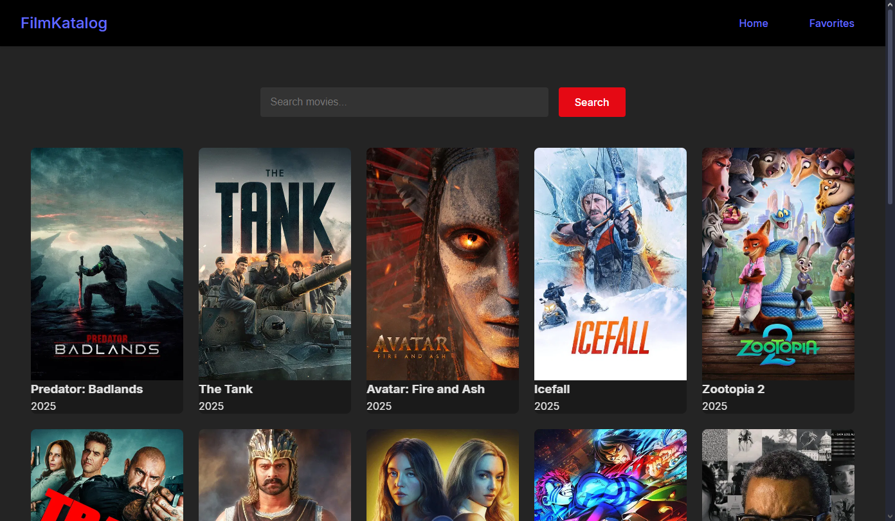
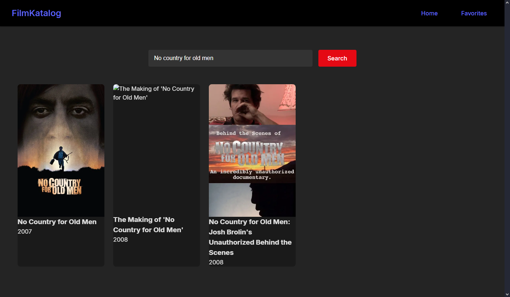
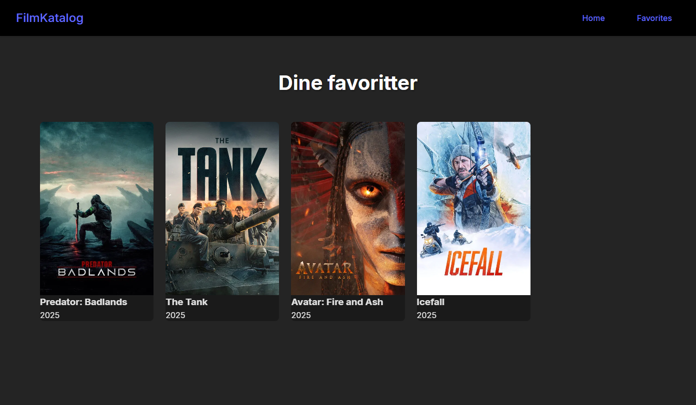

# FilmKatalog React + Vite

Filmkatalog er ein enkel React app som let deg bla gjennom populære filmar, angi favoritter og søkje etter filmar ved hjelp av The Movie Database (TMDB)-APIet. Dette er eit personlig api som ikkje delast offentlig så for demonstrasjon av appen sjå bildene nedenfor.

## Funksjonalitet
Viser ei liste over populære filmar.
Søkjefelt for å finne filmar basert på tittel.
Eiga side for favorittar (klart for vidare utviding).

## Teknologi
React 19
Vite 7
React Router
TMDB API (Bearer-token)

## Bilder

### Heimeside

### Søk etter film

### Favoriser film knapp

### Favoritt side
